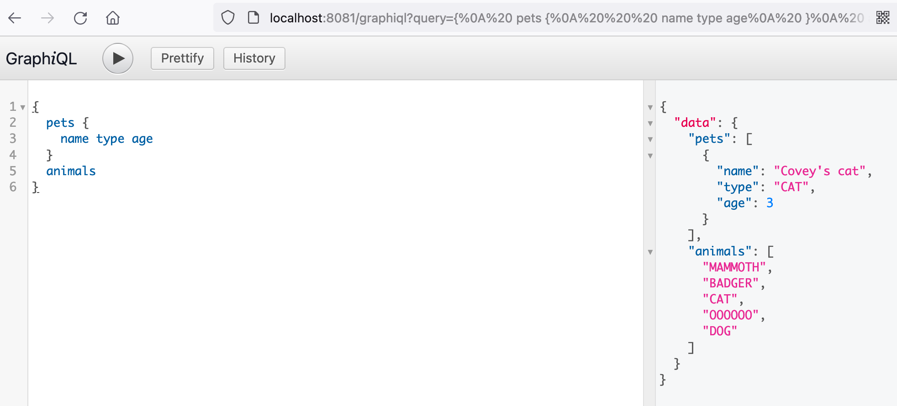

----------------query-------------
GraphiQL http://localhost:8081/graphiql

{
pets {
name type age
}
animals
}

or

curl -i -X POST -d  '{"query": "{pets{name type age}animals}"}' http://127.0.0.1:8081/graphql && echo

or

postman

{
"query": "{pets{name type age}animals}",
"operationName": "",
"variables": {}
}

----------------mutation-----------
GraphiQL http://localhost:8081/graphiql

mutation {
savePet(pet: {name: "Covey's dog", age: 3, type: DOG}) {
id
name
age
type
}
}

or
curl 'http://localhost:8081/graphql' -d $'{"query":"mutation {savePet(pet: {name: \\"Covey\'s dog\\", age: 3, type: DOG}) {id name age type}}","variables":null}'

or

postman

{
"query": "mutation {savePet(pet: {name: \"Covey's dog\", age: 3, type: DOG}) {id name age type}}",
"operationName": "",
"variables": null
}
